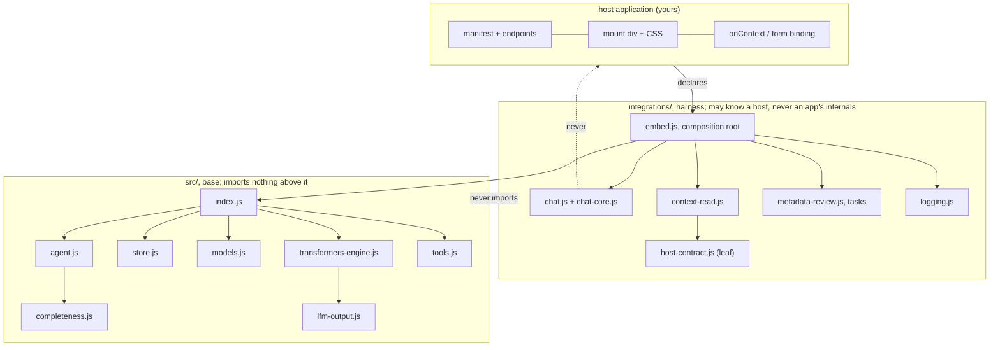

# Agent notes

For any agent or developer working **in this repository**. If you are integrating the assistant *into
another* application, start at [docs/GETTING_STARTED.md](docs/GETTING_STARTED.md) instead. This file is
about changing the SDK without breaking what it promises.

## What this is

An on-device assistant for browser applications. A host declares what the assistant may read, mounts
`<div data-pslm>`, and gets chat, bounded tools, provenance and a completeness verdict, with the model
running in the tab, no cloud, no API key, and no path from the model to a host write API.

## Read in this order

1. [docs/ARCHITECTURE.md](docs/ARCHITECTURE.md), the layers and the module map, with diagrams.
2. [docs/HARNESS.md](docs/HARNESS.md), what is enforced in code rather than asked for in a prompt.
3. [docs/HOST_CONTRACT.md](docs/HOST_CONTRACT.md), the `pslm-host/1` manifest. The main contract.
4. [docs/ADDONS.md](docs/ADDONS.md). The extension points, and what each one owes.
5. [docs/GETTING_STARTED.md](docs/GETTING_STARTED.md), the integrator's entry point, for context on who uses this.

## The invariants

These are the product, not preferences. A change that breaks one is wrong even if tests pass.

1. **`src/` never imports from `integrations/`.** The base layer knows nothing about a host, a manifest or
   a page. `integrations/` depends on `src/`, never the reverse.
2. **No path from the model to a write API.** `writeBack: true` fails the mount. Declared tools are GET-only.
   The only write is a human clicking a form, through a cancelable `pslm-fill-request` the host answers.
3. **The model cannot invent a saved value.** Host text is *appended* to the SDK's own description, never
   substituted for it, so a host cannot make the assistant claim a capability it lacks.
4. **Anything that reaches the model is bounded.** Byte caps on context and tool results, a window fit that
   drops oldest exchanges, a hard 5 tool calls per turn. Over a limit it degrades and says so; it never
   fails the turn.
5. **Reasoning is structurally separated from the answer.** Every round is seeded with the think opener,
   because the model's template supplies none.
6. **Weights are pinned by revision and verified by SHA-256**, never vendored, never trusted from a mirror.
   No placeholder models in the catalog.
7. **Model output and tool results are untrusted.** Render as text, never execute, never save unreviewed.

## Module map



`host-contract.js` is a leaf on purpose: manifest validation, byte caps and tool building are pure, so they
are testable without a browser. `embed.js` is the only place that wires everything together.

## Commands

```sh
npm test                 # 200 tests, no browser, no GPU
npm run build:embed      # dist/embed.js + chat.js + logging.js + embed-assets/
npm run dev              # the web app, chat, catalogue Q&A, field suggestion, benchmark
npm run e2e              # real Chrome, offline, fixtures
npm run e2e:retrieval    # real Chrome, retrieval against a generated corpus and index
npm run scaffold -- --out <dir> --shape static|record   # a host starting point
npm run pack:site -- --out <dir> --runtimes onnx        # the bundle subset a host serves
```

`dist/` is generated and never committed. The entry points ship under fixed names, so hosts bust their
cache with `version.json`'s `gitSha`, see `tools/site-pack.mjs` for how the acceptance page does it.

## Rules for changing things

- **Any logic logic ships with one minimal runnable check.** Pure logic goes in a module a test can
  import. There is a reason for that emphasis: `embed.js` imports the chat element, so **Node cannot import
  it at all**, which is why `context-read.js` exists as a separate module, and why a bug lived in it
  unnoticed until the reads moved out.
- **A prompt is not a guard.** If a rule matters it lives in code (see `docs/HARNESS.md`). Prompts advise.
- **Tests assert the contract, not the implementation.** Where two vocabularies meet, the manifest's
  `credentials: "none"` and `fetch()`'s `"omit"`, assert the value the runtime accepts. A stub that accepts
  anything validates nothing.
- **Comments explain why, and record the evidence.** The good ones cite what was observed on a real host; a
  justification without an observation is how the unseeded reasoning retry got in and leaked.
- **No emojis in code or docs.** Emoji appear only in a few UI strings in `integrations/chat.js`.

## Deliberately absent

Do not "fix" these without a decision and a test:

| absent | why |
|---|---|
| a ranker, embeddings, any retrieval | ranking needs the corpus, which is the host's; rung 4 of the context ladder is the seam, and rung 5 is gated on measurement. See `docs/CONTEXT_PROVIDERS.md` |
| any write path | the contract is read-only; a host applies changes after a human approves |
| host knowledge in `src/` | the base layer stays reusable across any host, including hosts written later |
| a bundled model | weights are hundreds of MB and licensed separately; the store downloads or imports them |
| DOM in `src/` | it is what makes the base testable and worker-safe |
| an npm dependency beyond `@huggingface/transformers` and `@wllama/wllama` | two runtimes, both pinned; a third needs a reason |

## Verifying a change

1. `npm test`.
2. `npm run build:embed`, then run `/portable-slm/host-check.html` against a real origin with
   `?manifest=<path>` (add `&sid=<record>` and `&log=<path>` where they apply). A `fail` is a contract
   violation; a `skip` is something not declared; **a page that reports nothing is not a pass**, check that
   it ran.
3. For anything touching context or tools: load a real record page and open **"What was sent to the model"**.
   It is the audit artefact, and it has caught what tests did not.
