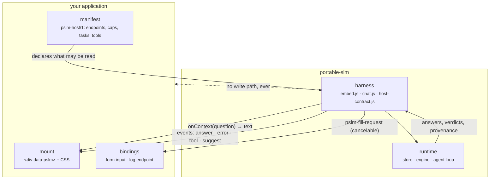

# portable-slm

**On-device AI for browser applications, with chat as the product.** `<pslm-chat>` installs a
SHA-256-verified model into the browser, streams answers locally, runs bounded tools, and takes its
context from a single host-supplied callback. There is no cloud inference endpoint, no telemetry and
no path from the assistant to a host write API.

The seam is one line. A host declares what may be read and answers one callback; everything else is the
SDK's:



The runtime never leaves the browser: weights are verified once per origin, inference is local, and the only
requests are the context reads you declared and the mirror you named.

The package is layered so a host can adopt as little as it wants:

| Layer | Artifact | What it is |
|---|---|---|
| **Chat (vanilla)** | `dist/chat.js`, `dist/chat.html`, `portable-slm/chat` | framework-free `<pslm-chat>`: install, import, load, stream, tools, approval, provenance. Runs with no host at all |
| **Core SDK** | `portable-slm` | verified GGUF storage, resumable download, WebGPU/CPU inference, bounded tool loop |
| **Host adapters** | `portable-slm/embed`, `./widget`, `./snapshot-context`, `./field-suggest`, `./qa-evidence` | manifest-driven context and tasks for a specific host application |

## Put it in your application

Three commands, into the directory your application already serves statically:

```sh
npm ci && npm run build:embed                                  # once, in this repository
npm run scaffold -- --out ../my-app/public/portable-slm --shape static   # or --shape record
npm run pack:site -- --out ../my-app/public/portable-slm --runtimes onnx
```

Then mount it, and write the manifest and the document it answers from:

```html
<div id="pslm-panel" class="pslm" data-pslm data-launcher="Ask this app" data-resize></div>
<script type="module" src="/portable-slm/embed.js"></script>
```

`--shape static` is a host with no API: one bounded document, chat only. `--shape record` is a host with an
API about one object: a snapshot per question, one editable field, one declared read tool. Both emit a
manifest that already passes validation and a `STARTER.md` checklist naming what to edit.

- **[Getting started](docs/GETTING_STARTED.md)**: the same path with the diagrams, the three host shapes,
  and the ownership table. Start here.
- **[The host contract](docs/HOST_CONTRACT.md)**: the `pslm-host/1` manifest field by field, the task ids,
  and what "accepted" means.
- **[Where context comes from](docs/CONTEXT_PROVIDERS.md)**: the five-rung ladder, and where to stop.
- **[Extensions](docs/ADDONS.md)**: the six places to attach, and what each one owes.
- **[Chat](docs/CHAT.md)**: attributes, events, theming, the completeness verdict.
- **[Tools](docs/TOOLS.md)**: authoring one, network policy, the limits the loop enforces.
- **[Architecture](docs/ARCHITECTURE.md)**: the layers, the module map, and why the boundaries are there.
- **[Harness](docs/HARNESS.md)**: what is enforced in code rather than asked for in a prompt.
- **[Answer quality](docs/ANSWER_QUALITY.md)**: corpus, retrieval, evaluation, and the bounded-context reach.
- **[Agent modes](docs/AGENT.md)**: declared tools, engine choice, model pins, MCP and search boundaries.
- **[Worked integrations](examples/README.md)**: two real hosts, their manifests and their routes. The only
  place in the documentation that names an application.

Three pages ship in the bundle and need no build step of their own: `chat.html` (the vanilla
surface), `host-check.html` (run the acceptance checks on your own origin) and
`framework-options.html` (compare implementation approaches, vanilla custom element, lit, Stencil,
React, Vue, Svelte, and read the recommendation).
### The documents, by kind

**Contracts**: normative. A host implements these, and `host-check.html` verifies them.

| document | what it fixes |
|---|---|
| [HOST_CONTRACT.md](docs/HOST_CONTRACT.md) | the `pslm-host/1` manifest, the context sources, the tasks, the acceptance definition |
| [CHAT.md](docs/CHAT.md) | the element's attributes and the events a host may rely on |
| [LOGGING / §logging](docs/HOST_CONTRACT.md#logging) | the optional log endpoint a host implements |
| [TOOLS.md](docs/TOOLS.md) | what a tool may be, and the limits the loop enforces |

**Guides**: how to build with it.

| document | read when |
|---|---|
| [GETTING_STARTED.md](docs/GETTING_STARTED.md) | integrating into an application, from zero, with diagrams |
| [CONTEXT_PROVIDERS.md](docs/CONTEXT_PROVIDERS.md) | deciding where answers come from: the five-rung ladder, and where to stop |
| [ADDONS.md](docs/ADDONS.md) | extending the harness: the six extension points and what each owes |
| [ARCHITECTURE.md](docs/ARCHITECTURE.md) | how the layers fit, and why the boundaries are where they are |
| [HARNESS.md](docs/HARNESS.md) | what is enforced in code rather than asked for in a prompt |
| [ANSWER_QUALITY.md](docs/ANSWER_QUALITY.md) | making answers good: corpus, retrieval, evaluation, and the bounded-context arithmetic |
| [AGENT.md](docs/AGENT.md) | agent modes, engine choice, model pins, MCP and search boundaries |
| [examples/README.md](examples/README.md) | the two worked integrations, end to end |
| [AGENTS.md](AGENTS.md) | working **in this repository**: invariants, module map, how to verify a change |

**Status**: what is proven, and what is not. Read before trusting any of the above.

| document | what it records |
|---|---|
| [IMPLEMENTATION_PLAN.md](docs/IMPLEMENTATION_PLAN.md) | status, release gates, the gated retrieval work |
| [DEVICE_VALIDATION.md](docs/DEVICE_VALIDATION.md) | what has been run on which device, and what has not |
| [examples/README.md](examples/README.md) | the first real workflow, on real hardware |

- [Chrome extension guide](integrations/chrome-extension/README.md)
- [Metadata consumer example](examples/README.md)
- [Implementation status and next steps](docs/IMPLEMENTATION_PLAN.md)

## When this is the right tool, and when it is not

Portable SLM is a few hundred million parameters, quantized, in a browser tab. What it guarantees is
about **where the computation happens**, not about how good the answer is: nothing you type leaves the
machine, the model bytes are verified by checksum, and it runs with no network at all.

| Right tool when | Wrong tool when |
|---|---|
| the material cannot leave the network: embargoed or confidential statistics | being wrong is costly: numbers, dates, quotes, decisions |
| no model service is reachable: field laptops, blocked mirrors, air-gapped offices | the answer needs knowledge the supplied context does not contain |
| a stated policy rules out pasting into a hosted assistant | long reasoning or multi-step analysis |
| someone drafts short text and a human edits it | volume: hundreds of records to process |
| a team needs to see what local inference actually is | anything autonomous, browsing, or acting without review |

The rule that settles most arguments: **the answer must be recoverable from the context you supply.**
In the snapshot → useful. Needs general knowledge → unreliable. Needs judgement → not a model's job.
The grounding stamp and the *"not in the record"* behaviour exist to make the failure visible, not to
fix the model, which is also why [answer quality is a corpus problem, not a model
problem](docs/ANSWER_QUALITY.md).

## Try the vanilla chat

```sh
npm install && npm run build:embed
npx serve dist        # open http://localhost:3000/chat.html
```

One custom element, no host application, no bundler:

```html
<pslm-chat model="lfm2.5-350m-q4km" tools="offline"></pslm-chat>
<script type="module" src="/portable-slm/chat.js"></script>
```

```js
chat.onContext = async () => await myAuthorizedSnapshot();   // the only host seam
```

### Any page, no host at all

The tabbed surface hosts embed works the same way with nothing declared. One script tag and one
element is a complete, honest assistant on any page of any application:

```html
<div data-pslm style="width:24rem;height:32rem"></div>
<script type="module" src="/portable-slm/embed.js"></script>
```

No manifest, no record, no knowledge of what the page is about: chat, install, import, build stamp.
Portable SLM's own description of itself is always in the prompt (`composeContext`, append-only), so
the assistant can say what it is and what it cannot do; a host's `onContext` text is added after it,
never in place of it. Adding a manifest and a record id is what unlocks grounded answers about data,
and a page with no record can declare `context.app` to be grounded in the application's own help text
instead. The whole ladder is
[`HOST_CONTRACT.md` §1b](docs/HOST_CONTRACT.md#1b-the-panel-degrades-it-does-not-refuse).

## Run

```sh
npm install
npm run dev                 # web chat: http://localhost:5173/
                            # catalogue Q&A: http://localhost:5173/catalogue-qa.html
                            # metadata review: http://localhost:5173/field-suggest.html
                            # general benchmark: http://localhost:5173/benchmark.html
npm run build && npm run preview  # offline-capable static web build, port 4173
npm run build:embed    # dist/chat.js + dist/chat.html + dist/embed.js + host-check.html + embed-assets
npm run scaffold -- --out <dir> --shape static|record   # a correct host starting point
npm run pack:site -- --out <dir> --runtimes onnx|wllama|both   # the bundle subset a host serves itself
                       # both builds also write dist/version.json (version, gitSha, builtAt)
npm run build:extension     # unpacked desktop Chrome extension in dist-extension/
npm test                    # SHA-256, store, agent/tool safety, example adapters
npm run e2e                 # Chrome: mirror/import → chat + catalogue Q&A + review + benchmark, offline
# Developer-only extension test, in an environment where unpacked extensions are authorized:
CHROME_PATH=/path/to/approved-test-chrome npm run e2e:extension
```

The E2E tests use `.cache/models/LFM2.5-350M-Q4_K_M.gguf`; `npm run e2e` downloads it if absent.
`e2e:extension` imports that file rather than redownloading it. A managed-Chrome policy block
requires IT approval; do not use a different browser build to evade it.

## Use subsystem from another web UI

```js
import { createLocalSLM } from "./src/index.js";
import wasm from "@wllama/wllama/esm/wasm/wllama.wasm?url";
import compatWasm from "@wllama/wllama-compat/wasm/wllama.wasm?url";
import compatWorker from "@wllama/wllama-compat/wasm/wllama.js?url";

const ai = createLocalSLM({ assets: { wasm, compatWasm, compatWorker } });
const model = "lfm2.5-350m-q4km";
if ((await ai.status(model)).state !== "installed") {
  await ai.importModel(fileFromPicker); // or ai.download(model) while online
  // or ai.download(model, { sources: [yourHttpsMirror, ai.models[model].url] })
}
await ai.load(model);

// Plain streaming chat; no tools or internet required.
await ai.generate([{ role: "user", content: "Summarize this note." }], { onToken: append });

// Agent: the model can select declared tools. Offline is the default.
const r = await ai.runAgent([{ role: "user", content: "What time is it?" }], {
  onTool: (event) => showToolEvent(event),
});
console.log(r.text);

// Optional online tool: requires opt-in AND approval of exact arguments for each call.
await ai.runAgent([{ role: "user", content: "Search Wikipedia for France." }], {
  allowNetwork: true,
  approveTool: ({ name, args }) => confirm(`Send ${name} ${JSON.stringify(args)} online?`),
});
```

### OpenAI-shaped local chat API

An optional adapter provides `chat.completions.create()` request/response shapes directly in JS:

```js
import { createOpenAICompatibleClient } from "./src/openai-compatible.js";

const local = createOpenAICompatibleClient(ai);
const completion = await local.chat.completions.create({
  model,
  messages: [{ role: "user", content: "Summarize this note." }],
  max_completion_tokens: 128,
});
console.log(completion.choices[0].message.content);
```

Set `stream: true` to receive an `AsyncIterable` of completion chunks. This is an in-process
browser API: no HTTP endpoint, API key or network request. It supports text messages and basic
sampling/JSON options; use `ai.runAgent()` for declared tools. It does not claim full OpenAI API
compatibility. Vision, audio and classifier runtimes stay outside this adapter; add each as an
optional task module only after its model/runtime and browser limits are validated. Do not add
placeholder models to the pinned GGUF catalog.

The host must bundle JS/WASM locally and precache its app assets for offline use. Models and cache
belong to the **browser origin**: the extension, this app and an external site each need their
own import/download. See [`src/index.d.ts`](src/index.d.ts) for the complete API.

## Evidence-checked Q&A (a shipped view)

The app ships `/catalogue-qa.html`, which demonstrates the strongest grounding claim this SDK makes. Load one
published study while online and it stores a bounded title/abstract snapshot locally, so the view reopens
offline with a cached model. Ask a question and the model is asked for a verbatim quote from that snapshot;
the quote is then checked against the snapshot it sent. A quote that does not appear is marked
**unverified**, and a quote that does appear is not proof that the interpretation is right: it is proof that
the answer was recoverable from the supplied context. Read-only, no account, no write API. The check itself is
`src/qa-evidence.js`, and it is what a host should copy for any grounded Q&A task.

## Worked integrations

Two real host applications shaped this SDK: a record editor with a curator ACL, and a public data catalogue.
Their manifests, routes, tasks, and everything they changed in the SDK are documented in
[`examples/README.md`](examples/README.md) — the only place in this documentation that names an application.
The contract itself is host-agnostic, and a host of neither shape integrates the same way.

## Offline setup

Open the web app once on HTTPS so the service worker caches its files. Download a listed model
from Hugging Face or an alternate HTTPS mirror, or import the same GGUF from Files/USB; the store
verifies the **same pinned SHA-256** regardless of source. **Offline readiness** checks cached app
assets and the verified model separately; then reopen the site without internet. The model manager
shows approximate browser storage use/quota and installed or partial models. On `Quota exceeded`,
select an unused model and **Remove** it, then resume; existing models are never deleted automatically.
HF's embedded Space and a direct static app tab may have separate storage partitions, so a model
installed in one may not appear in the other. Offline tools work; online Wikipedia search is neither advertised to the model nor run
unless enabled and approved. Browser storage may be evicted, so keep the source GGUF for reimport.

## Compare models

The app has two views for comparing pinned models: `/benchmark.html` runs 12 short authored cases covering
classification, JSON extraction, grounded QA, instruction following and a fixture-based tool call, and the
chat page's **Field suggestion** and **Benchmark** buttons mount the same views in place, reusing one loaded
model.

Results checkpoint after each case, resume after a reload, compare installed models, and export JSON. This is
a smoke benchmark, not a broad quality claim; it exists to tell two models apart on your own device. See
`bench/tasks.js` and `bench/run.js`.

A view mounted in this app shares one model cache with the chat page. A view opened as its own tab on another
origin does not: model storage is per origin, so it needs its own install.
## License

Portable SLM source code is MIT licensed; see [`LICENSE`](LICENSE). wllama is MIT licensed.
Model weights have separate terms: Liquid AI models use LFM Open License v1.0, including its
conditions. Review the license for each model before redistributing weights; this SDK does not
bundle model files.
