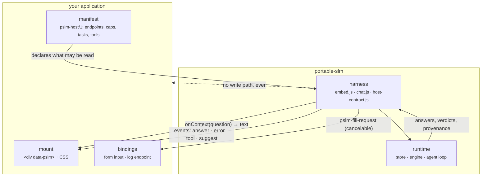

# portable-slm

**A language model that runs in the browser tab, with nothing leaving the device.** `<pslm-chat>` verifies
and installs a pinned model, streams answers locally, runs bounded tools, and takes its context from a single
host-supplied callback. No cloud inference, no API key, no telemetry, and no path from the assistant to a
host write API.

The seam is one line. A host declares what may be read and answers one callback; everything else is the SDK's:



## Put it in your application

Three commands, into a directory your application already serves:

```sh
npm ci && npm run build:embed                                            # once, in this repository
npm run scaffold -- --out ../my-app/public/portable-slm --shape static    # or --shape record
npm run pack:site -- --out ../my-app/public/portable-slm --runtimes onnx
```

Then mount it, and write the manifest and the document it answers from:

```html
<div id="pslm-panel" class="pslm" data-pslm data-launcher="Ask this app" data-resize></div>
<script type="module" src="/portable-slm/embed.js"></script>
```

`--shape static` is a host with no API: one bounded document, chat only. `--shape record` is a host with an
API about one object: a snapshot per question, one editable field, one declared read tool. Both emit a
manifest that already passes validation, plus a `STARTER.md` checklist naming what to edit.

**Retrieval is on by default.** Declare the documents the assistant may answer from and every question is
answered from the sections that match it, rather than one document cut at the byte cap:

```json
"context": { "documents": [{ "url": "handbook.md", "label": "handbook" }] },
"retrieval": { "topK": 5, "maxBytes": 6144 }
```

The default embedder is bundled with the SDK, so there is nothing to install, no revision to pin and no
weight file to host: BM25 answers the first question immediately and the embeddings join in milliseconds.
Freeze the corpus once and every reader fetches vectors instead of embedding it: `npm run index -- <corpus-dir>
--out <file>` writes a prebuilt artifact, keyed by a hash of the corpus so it can never be silently stale.
Indexing a 1.9 MB documentation corpus measured 96 seconds; frozen, that cost is paid once, at build time, and
never by a reader. `"retrieval": { "index": "/pslm.index.json" }` declares it.

`"retrieval": { "embedder": "none" }` opts out to keyword search with nothing fetched at all, and
`"embedder": "embeddinggemma-2-text-q4f16"` asks for the larger pinned model instead. Both tiers are measured
against your own corpus rather than argued about: [RETRIEVAL.md](docs/RETRIEVAL.md).

## Models

Six pinned models, all installed on demand into browser storage, all verified by SHA-256 against an immutable
upstream revision. A host declares which it offers and which one it starts from; a reader can switch tiers in
the panel.

| model | download | window | engine | for |
|---|---|---|---|---|
| **LFM2.5 2.6B ONNX q4f16** | 1.48 GB | 65 536 | ONNX · WebGPU | the strongest answers, and what the worked hosts run. Needs a capable device |
| LFM2.5 1.2B-Instruct ONNX q4f16 | 728 MB | 32 768 | ONNX · WebGPU | the middle tier: better than the small models, cheaper than the large one |
| LFM2.5 350M ONNX q4f16 | 246 MB | 32 768 | ONNX · WebGPU | the fastest first run, and the tier that fits a weak laptop or a phone |
| LFM2.5 350M GGUF q4km | 219 MB | 32 768 | wllama · WASM | GGUF targets, and the default for a bare mount with no manifest |
| LFM2.5 230M GGUF q4km | 146 MB | 32 768 | wllama · WASM | the smallest tier, for constrained devices |
| LFM2.5 350M QAD q4_0 | 209 MB | 32 768 | wllama · WASM | a quality-per-byte alternative at the low end |

```json
"model": "lfm2.5-2.6b-onnx-q4f16",
"models": { "available": ["lfm2.5-2.6b-onnx-q4f16", "lfm2.5-350m-onnx-q4f16"] }
```

Sizes are the bytes that actually leave the wire: a multi-file ONNX export or a single GGUF, either way hashed
and checked before it is used. The catalogue, with revisions and per-file hashes, is
[`src/models.js`](src/models.js).

Because the weights are large, the download is a user action, never something a page does on load, and worth
naming in the interface. A visitor to a public site should be told what they are about to fetch.

## What it guarantees

- **Where the computation happens.** The model runs in the tab. There is no inference endpoint, no key, and no
  telemetry, and nothing you type leaves the machine.
- **What was installed.** Model bytes are pinned to an immutable revision and verified by SHA-256 regardless of
  whether they came from the network, a mirror, or a file the user picked.
- **That it works without a network.** Once the shell and the weights are on the device, inference needs
  nothing else.
- **That it cannot write.** There is no path from the model to a host write API. A draft reaches a form only
  when a person clicks, through the host's own input and validation.
- **That everything reaching the model is bounded and disclosed.** Byte caps on context and tool results, a
  window that drops the oldest exchanges and says so, at most five tool calls per turn, and an audit view
  showing the exact prompt that was sent.

## What that means for use

A locally running model is a capable drafter, not an oracle. It is strong on short, grounded work and frank
about what it cannot find; it is not a substitute for a hosted frontier model, and it is not a database.

| a good fit | a poor fit |
|---|---|
| the material cannot leave the network: embargoed or confidential records | being wrong is costly: final numbers, dates, quotes, decisions |
| no model service is reachable: field laptops, blocked mirrors, air-gapped offices | the answer needs knowledge the supplied context does not contain |
| a policy rules out pasting into a hosted assistant | long reasoning or multi-step analysis |
| someone drafts short text and a person edits it | volume: hundreds of records to process |
| a team wants to see what local inference actually is | anything autonomous, browsing, or acting without review |

The rule that settles most arguments: **the answer must be recoverable from the context you supply.** In the
snapshot, useful. Needs general knowledge, unreliable. Needs judgement, and it is not the model's job. The
grounding stamp and the *"not in the record"* behaviour exist to make that boundary visible, which is also why
[answer quality is a corpus problem, not a model problem](docs/ANSWER_QUALITY.md).

## Try it

```sh
npm install
npm run dev            # http://localhost:5173/
npm run build:embed    # the bundle a host serves: embed.js, chat.js, embed-assets/
```

The vanilla component alone, on any page, with no host application and no bundler:

```html
<pslm-chat model="lfm2.5-350m-onnx-q4f16" tools="offline"></pslm-chat>
<script type="module" src="/portable-slm/chat.js"></script>
```

```js
chat.onContext = async (question) => await myAuthorizedSnapshot();   // the only host seam
```

Or the tabbed panel, which adds install, import, a model bar and provenance to the same element:

```html
<div data-pslm style="width:24rem;height:32rem"></div>
<script type="module" src="/portable-slm/embed.js"></script>
```

With nothing declared it is still an honest assistant: it says what it is and what it cannot do, because the
SDK's own description is always in the prompt and a host's text is appended after it, never substituted for it.
A manifest and a record id are what unlock grounded answers about data, and a page with no record can declare
`context.app` to be grounded in the application's own documentation. The whole ladder is
[`HOST_CONTRACT.md` §1b](docs/HOST_CONTRACT.md#1b-the-panel-degrades-it-does-not-refuse).

## The SDK, without the UI

The panel is optional. The runtime is an ES module, and a host that already has a frontend can use it directly:

```js
import { createLocalSLM } from "portable-slm";

// Assets are URLs your bundler resolves: the pack writes embed-assets.json naming the runtime files
// (onnxWasm.wasm + onnxMjs.mjs for ONNX, wasm.wasm + compatWasm.wasm + compatWorker.js for GGUF).
const ai = createLocalSLM({ assets });
const model = "lfm2.5-2.6b-onnx-q4f16";
if ((await ai.status(model)).state !== "installed") await ai.download(model);   // or importModel(file)
await ai.load(model);

await ai.generate([{ role: "user", content: "Summarize this note." }], { onToken: append });
const r = await ai.runAgent([{ role: "user", content: "What time is it?" }], { onTool: show });
```

GGUF models use wllama instead of ONNX Runtime, and take `wasm`, `compatWasm` and `compatWorker` assets; the
engine is chosen by the model entry, not by the caller. `runAgent` is the bounded tool loop: arguments are
validated against your schema, network tools need opt-in **and** per-call approval of the exact arguments, and
results are byte-capped. [`src/index.d.ts`](src/index.d.ts) is the complete API.

An optional [`openai-compatible`](src/openai-compatible.d.ts) adapter exposes
`chat.completions.create()` shapes over the same in-process runtime, including streaming. It is a JS API, not
an HTTP server: no endpoint, no key, no network. Use `runAgent()` for declared tools.

## What ships in the app

`/` is chat and the model manager; `/catalogue-qa.html` is evidence-checked Q&A, which asks the model for a
verbatim quote and marks the answer **unverified** when the quote is not in the snapshot it sent;
`/field-suggest.html` reads a snapshot and drafts one field; `/benchmark.html` runs 12 authored cases and
compares installed models; `/host-check.html` runs the acceptance checks against a host origin and prints the
report to paste into a ticket. The assistant's own description says as much on any page it is dropped into.

## Run

```sh
npm run dev                     # web app on http://localhost:5173/
npm run build && npm run preview   # static build, offline-capable, port 4173
npm run build:embed             # the host bundle: embed.js, chat.js, logging.js, embed-assets/, pages
npm run scaffold -- --out <dir> --shape static|record        # a host starting point
npm run pack:site -- --out <dir> --runtimes onnx|wllama|both  # the bundle subset a host serves
npm run build:extension         # unpacked desktop Chrome extension in dist-extension/
npm test                        # 163 cases, no browser: store, agent, contract, harness, examples
npm run e2e                     # Chrome: local mirror → import → offline chat, Q&A, suggestion, benchmark
CHROME_PATH=/path/to/approved-chrome npm run e2e:extension   # where unpacked extensions are authorized
```

`build:embed` also writes `dist/version.json` (version, git revision, build time). The panel shows that build
stamp, which is the first thing to compare when a fix appears not to have landed.

The extension test needs a Chrome build your organization permits. A managed-browser policy block is there for
a reason; do not work around it with another build.

## Offline

Open the app once over HTTPS so its service worker caches the shell, then install a model from Hugging Face,
an alternate HTTPS mirror, or a file from disk. Readiness is checked as two separate things, the app shell and
the verified model, because `navigator.onLine` says nothing about either. After that the app runs with no
network.

Storage is per browser origin, so a model installed on one origin is invisible to another: your app, a
another origin and an extension each need their own copy. Browsers can evict it, in which case re-import the file
you kept. The model manager shows approximate usage and quota, and on a quota error it keeps what is installed
and asks before removing anything.

## The documents, by kind

**Contracts** — normative. A host implements these, and `host-check.html` verifies them.

| document | what it fixes |
|---|---|
| [HOST_CONTRACT.md](docs/HOST_CONTRACT.md) | the `pslm-host/1` manifest, the context sources, the tasks, the acceptance definition |
| [CHAT.md](docs/CHAT.md) | the element's attributes, and the events a host may rely on |
| [TOOLS.md](docs/TOOLS.md) | what a tool may be, and the limits the loop enforces |
| [HOST_CONTRACT.md §8c](docs/HOST_CONTRACT.md#8c-logging) | the optional log endpoint a host implements |

**Guides** — how to build with it.

| document | read when |
|---|---|
| [GETTING_STARTED.md](docs/GETTING_STARTED.md) | integrating into an application, from zero, with diagrams |
| [CONTEXT_PROVIDERS.md](docs/CONTEXT_PROVIDERS.md) | deciding where answers come from: the five-rung ladder, and where to stop |
| [RETRIEVAL.md](docs/RETRIEVAL.md) | indexing a corpus: hybrid BM25 and embeddings, the index format, and how to build one |
| [ADDONS.md](docs/ADDONS.md) | extending the harness: the six extension points and what each owes |
| [ARCHITECTURE.md](docs/ARCHITECTURE.md) | how the layers fit, and why the boundaries are where they are |
| [HARNESS.md](docs/HARNESS.md) | what is enforced in code rather than asked for in a prompt |
| [ANSWER_QUALITY.md](docs/ANSWER_QUALITY.md) | making answers good: corpus, retrieval, evaluation, bounded context |
| [AGENT.md](docs/AGENT.md) | agent modes, engine choice, model pins, MCP and search boundaries |

**Status** — what is proven and what is not. Read before trusting any of the above.

| document | what it records |
|---|---|
| [STATUS.md](docs/STATUS.md) | what is verified, what is not, and what is deliberately unbuilt |
| [DEVICE_VALIDATION.md](docs/DEVICE_VALIDATION.md) | what has been run on which device, and what has not |
| [examples/README.md](examples/README.md) | the two worked host integrations, end to end |
| [AGENTS.md](AGENTS.md) | working **in this repository**: invariants, module map, how to verify a change |

## License

The source is MIT; see [`LICENSE`](LICENSE). wllama is MIT. The runtime dependencies are four, all pinned:
`@huggingface/transformers`, `@wllama/wllama`, `@wllama/wllama-compat` and `@ternlight/base`
(the default retrieval embedder, whose model ships inside the package). Model weights are **not** bundled and carry their own terms:
Liquid AI's models use the LFM Open License v1.0, and EmbeddingGemma 2 is Apache-2.0, so review the
terms before redistributing weights.

The npm package is not published yet. Until it is, a host vendors the built bundle, and
[GETTING_STARTED.md](docs/GETTING_STARTED.md) is the path.
