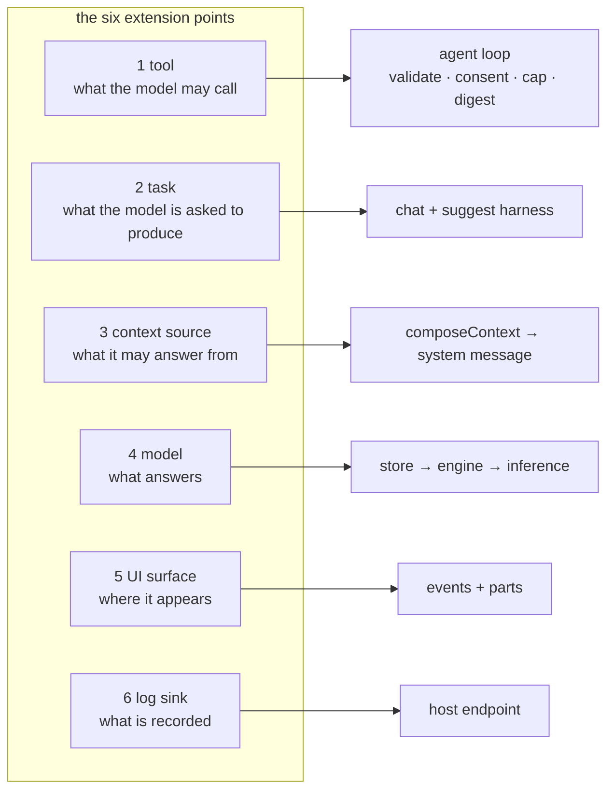

# Extensions: the six extension points

An extension extends the harness without forking it. There are exactly six places to attach, and each one has
a contract: the files to touch, what you owe, the test it needs, and how it fails when done wrong.

None of these is a plugin system: an extension is ordinary code in the layer that owns the concern. That is
deliberate. A plugin API would have to be versioned and defended, while a seam is something a reader can
verify by reading two files.

---

## 1. A tool: something the model may call

**Where.** Built-ins live in `src/tools.js` (`defaultTools()`); host tools are *declared* in the manifest
and built by `hostTools()` / `buildHostTools()` in `integrations/host-contract.js`.

**You owe:** a `name` matching `^[a-z][a-z0-9_]{1,63}$`, a `description` the model reads, a `parameters`
object using the schema subset the validator accepts (`string` · `number` · `boolean`, optional `enum`), and
`run(args, { signal })`. Optionally `network: true` (offline is the default), `maxResultBytes`,
`digest: true`.

**What the loop then does for you**: `src/agent.js`:

- validates every argument against your schema and rejects unknown keys;
- refuses network tools unless the caller enabled them *and* approved the exact arguments;
- pins the record id to the route, so the model cannot choose whose data it reads;
- caps the result (`maxResultBytes`, 2 KB default) and **trims rather than failing**;
- digests an oversized result through an isolated turn when you set `digest: true`;
- runs at most 4 calls per round and 5 per turn, skips an identical repeat call, and hands back a failed
  call as a tool result instead of ending the turn.

**Test:** build it with an injected `fetch` and assert the URL it produced, as `test/host-contract.test.js`
does. The allowlist is the security boundary, so it is asserted, not assumed.

**Fails when:** the description says more than the tool does. A tool the model names but cannot reach is
worse than no tool: it spends a round and reports an error the reader cannot interpret.

---

## 2. A task: a bounded job with a typed result

**Where.** The registry is `TASKS` in `integrations/host-contract.js`. An implementation is a module like
`integrations/field-suggest.js`, which exports `suggestMetadata(ai, request)` and its task ids. The chat
harness in `integrations/embed.js` is what dispatches and displays it.

**You owe:** a task id added to `TASKS` (an unknown id in a manifest **fails the mount**, by design), a pure
prompt builder, a **shape check** on the model's output, and a result envelope the UI can render. Decide
whether it is record-scoped (then `mountMode()` gates it on `context.record`) or works without one, today
all three shipped tasks are record-scoped, which is why a formless host gets chat and nothing else.

**Test:** the prompt builder and the shape check are pure, test them directly, as
`test/metadata-review.test.js` does. The shape check is not factual validation; say so in the UI.

**Fails when:** a task returns unvalidated model text that the host applies. The contract is that a task
returns a *draft* with its reason, and the host keeps validation, review and save.

---

## 3. A context source

**Where.** Rungs 1, 3 of the ladder (`docs/CONTEXT_PROVIDERS.md`): manifest `context.*`, fetched by
`integrations/context-read.js` (app/record/field) and `integrations/datafile-context.js`. A new *kind* of
source means a fetcher beside those, wired through `composeContext` in `embed.js`. Rung 4 needs no SDK
change at all: you do it in your own `onContext`.

**You owe:** the same-origin guard, the declared credentials (translated with `fetchCredentials()`, the
manifest says `same-origin`/`none`, `fetch()` says `same-origin`/`omit`), a content-type check so an HTML
login page never becomes a prompt, a byte cap, and an error message that diagnoses rather than reports a
status code.

**Test:** `test/context-read.test.js` is the pattern, inject `fetch`, `origin` and the manifest, then assert
what the model would have received.

**Fails when:** the cap is missing (a 400 KB string into an 8 K window fails opaquely) or the same-origin
guard is skipped (the panel would be reading another origin's data).

---

## 4. A model

**Where.** `src/models.js`, the pinned catalog. Nothing else changes: `src/store.js` downloads, chunks,
stores and verifies; `src/index.js` picks the engine by the entry's `runtime`, and
`src/transformers-engine.js` or wllama runs it.

**You owe:** `label`, `runtime` (`transformers` for ONNX, `wllama` for GGUF), `format`, `repo`, an immutable
`revision`, `ctx`, `license`, `verified`, and **every file with its byte length and SHA-256**. For ONNX that
is the whole multi-file export, `onnxFiles()` builds the entries.

**Test:** `test/models.test.js` asserts the catalog's shape; the store's own tests cover verification and
resume. A pinned hash that is wrong fails at install, loudly, on the user's machine, so verify before
committing the entry.

**Fails when:** a placeholder or an unpinned model is added "for later". The catalog is a promise about
bytes; do not add an entry you have not hashed.

---

## 5. A UI surface

**Where.** `integrations/chat.js` is the `pslm-chat` custom element (shadow DOM, `part=` attributes);
`integrations/embed.js` is the panel around it, whose template and CSS are all wrapped in `:where()` so a
host stylesheet overrides any of it. Events are the host-facing API. The full list is in `docs/CHAT.md`.

**You owe:** a `part=` or `data-` name a host can target, no host knowledge in the component, and an event
for anything a host might need to react to. Text and model output render through `textContent`, never
`innerHTML`.

**Test:** the pure half belongs in `integrations/chat-core.js` (DOM-free, tested); the DOM half is verified
by hand or through the acceptance page. Keep the split, because it is what makes any of it testable, and
note that `embed.js` cannot be imported in Node at all.

**Fails when:** the component learns an application's vocabulary (a field name, a route, a schema). That
belongs in the host's manifest.

---

## 6. A log sink

**Where.** `integrations/logging.js` forwards the SDK's events; the endpoint is the host's. The contract is
HOST_CONTRACT.md §8c.

**You owe:** an authenticated, same-origin endpoint that stamps identity and time itself, ignores any
reserved key in the body (`ts`, `user_id`, `user`, `sess`, `ip`, `event`), bounds the body again, and picks
its own file path and rotation.

**Test:** `test/logging.test.js` asserts the request body, the contract a host implements.

**Fails when:** the body is trusted for identity. A log line that can claim another user is not an audit
trail, and a failed log must never surface in the conversation.

---

## What an extension must never do

- Add host knowledge to `src/`, the base layer never learns an application.
- Introduce a write path. There is none, structurally; a draft reaches a form only through a human click.
- Skip a cap, a same-origin check, or an approval gate because "the tool is trusted". The gate is what makes
  the declaration mean something.
- Add a dependency for what a few lines do. The runtime dependencies are two, both pinned.
- Ship without a test, if it is logic. If it decides what the model sees or what it may do, it is logic.

## Verifying an extension

1. `npm test`.
2. `npm run build:embed`, then the acceptance page on a real origin with `?manifest=<path>`.
3. If it reaches the model: load a real record page and read **"What was sent to the model"**. It is the
   audit artefact and it has caught what tests did not.
4. If it is a host tool: the acceptance page calls every declared tool and reports what came back.

## Where to go next

| read | for |
|---|---|
| [GETTING_STARTED.md](GETTING_STARTED.md) | integrating this into an application, from zero |
| [HOST_CONTRACT.md](HOST_CONTRACT.md) | the manifest field by field, and the acceptance definition |
| [CONTEXT_PROVIDERS.md](CONTEXT_PROVIDERS.md) | the context ladder: where context comes from and where to stop |
| [CHAT.md](CHAT.md) | attributes, events, theming, the completeness verdict |
| [ARCHITECTURE.md](ARCHITECTURE.md) | how the layers fit, and why the boundaries are where they are |
| [HARNESS.md](HARNESS.md) | what is enforced in code, and what is only advised |
