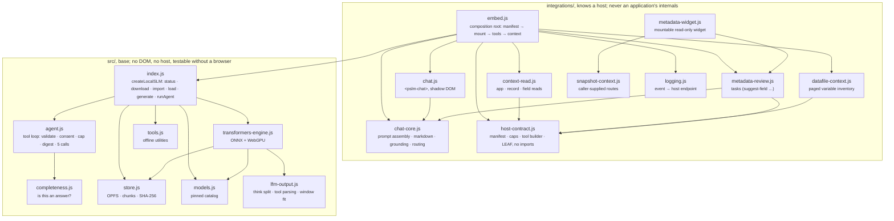

# Portable SLM architecture

Portable SLM is a **general-purpose on-device AI capability service for browser applications**.
the two worked host integrations are worked integration examples and initial priorities, not exclusive
targets or core dependencies. Current host-specific adapters cover these two; other web apps can
reuse the SDK/PWA but need their own bounded-context connector and task UI. Laptop, iOS Safari and
Android Chrome are target browsers; Portable SLM is not a native-only app or local inference
daemon. This is SaaS-like in its consumer contract, not cloud inference: the model runs on the user's
device. The subsystem owns verified model storage, inference, a bounded tool
loop and tool permissions. Network access is optional for data refresh/sync or explicitly approved
tools; it is not the default inference path.

```text
Any browser application (two worked hosts in `examples/`), web chat, Chrome side panel
        │ context snapshot + user request (never automatic page scraping)
        ▼
integrations/  harness + host contract (no framework, no app knowledge)
        ├─ embed.js             mount a panel/host page, model bar, declared host tools
        ├─ chat.js  <pslm-chat> transcript, streaming, reasoning trace, approval, provenance
        ├─ chat-core.js         pure prompt assembly + markdown parsing (unit-tested, no DOM)
        ├─ host-contract.js     validate the host manifest; bad contract fails the mount
        └─ metadata-review.js   the Suggest-field / Suggest-datafile tasks
        ▼
src/index.js  SDK: status · import/download · load · generate · runAgent · remove · unload
        ├─ src/transformers-engine.js  ONNX + WebGPU (WASM/CPU fallback), KV-cache reuse
        ├─ wllama                      bundled WASM; GGUF targets, Chrome WebGPU/CPU, iOS CPU
        ├─ src/lfm-output.js           think-block split + lenient marker tool-call parsing
        ├─ src/agent.js                tool loop: validation, consent, ≤5 calls, byte caps
        ├─ src/tools.js                offline date + safe calculator; opt-in Wikipedia search
        ├─ src/store.js                OPFS primary, Cache API fallback, 16 MB chunks, SHA-256
        ├─ src/models.js               pinned catalog: URLs, SHA-256, per-model context window
        └─ src/readiness.js            app-shell + verified-model offline check
        ▼
model weights stored per browser origin → local inference
```

## Host and SDK responsibilities

A host connector reads only data the signed-in user is allowed to access and passes a bounded
snapshot into the local runtime. Portable SLM returns a draft; the host keeps schema validation,
review, save and publish authority. The two worked hosts are an authoring tool and a catalogue, and the
publishing step between them stays the first host's existing workflow. Both are documented, with the routes
and manifests they use, in [`examples/README.md`](../examples/README.md); nothing here needs them in order to
integrate the SDK.

## Components and boundaries

The dependency direction is the rule: `src/` imports nothing from `integrations/`, and `integrations/` imports
from `src/`. That is what keeps the base reusable by a host written later, and it is the first thing to check
in a review.



| Component | Path | Responsibility |
|---|---|---|
| Engine and model vault | `src/index.js`, `src/transformers-engine.js`, `src/store.js`, `src/models.js` | Verify/download/import weights, load one model, generate text, delete/unload; no DOM or host knowledge |
| Inference output layer | `src/lfm-output.js` | Split hidden reasoning from displayable content while streaming; parse marker tool calls leniently; replay marker-shaped history into the template |
| Tool loop | `src/agent.js`, `src/tools.js` | Validate arguments against declared schemas, enforce offline mode/consent/byte caps, ≤5 tool calls; never executes model-authored code |
| Chat harness | `integrations/chat-core.js`, `integrations/chat.js` | Prompt assembly, direct-reply routing, markdown rendering, streaming UI, reasoning trace, provenance. Pure logic is DOM-free and tested |
| Host contract | `integrations/host-contract.js`, `integrations/embed.js` | Read the host's manifest, validate routes/tools/limits, build tools from it. An invalid contract fails the mount, never the conversation |
| Host panel (worked example) | `examples/README.md` | How a host mounts the panel, declares routes, tasks and tools, and bridges *Fill this field* into its own form: the only write path, and it is a user click |
| Suggestion tasks | `integrations/field-suggest.js`, `integrations/datafile-context.js` | Field and data-file-description drafts: bounded facts in, strict JSON out, host reviews and fills |
| Web chat consumer | `demo/index.html`, `demo/main.js` | Model manager, alternate mirror URL, offline-readiness check, chat and tool toggles |
| catalogue Q&A consumer | `demo/catalogue-qa.html`, `demo/catalogue-qa-view.js`, `src/qa-evidence.js` | Fetch one public study, save its bounded title/abstract, ask locally with evidence check; offline reopen |
| Benchmark consumer | `demo/benchmark.html`, `bench/` | Twelve authored general-task fixtures; for each example checkpoint, local comparison and JSON export |
| Chrome consumer | `integrations/chrome-extension/` | MV3 side panel; selected/page text on explicit click; bundled engine + local model in extension storage |

`src/index.js` is the contract consumed by every UI. It exposes `createLocalSLM({assets,ctx})`
with `status(id)`, `download(id)`, `importModel(file)`, `load(id)`, `generate(messages)`,
`runAgent(messages,{tools,allowNetwork,approveTool,onTool,onToken,onReasonToken,onMetrics})`,
`remove(id)` and `unload()`. `generate` streams; the agent streams its final answer too, so a tool
turn shows the same live text as a plain one. `onReasonToken` and `onMetrics` are LFM-only
(reasoning trace and live token count) and are deliberately **not** forwarded to wllama, where they
would be misread as sampling parameters.
See [`src/index.d.ts`](../src/index.d.ts) for exact types.

### Distribution: one bundle, no bundler in the host

`npm run build:embed` (Vite) produces a single `dist/embed.js` ES module; `tools/embed-assets.mjs`
copies the runtime binaries, both wllama WASM builds and the self-hosted ONNX Runtime WASM, into
`dist/embed-assets/` and writes `embed-assets.json`, so a host page never imports a `node_modules`
path and inference never downloads runtime code at run time. A host serves the result from its
own static root and must bust it, because a stale `embed.js` after a deploy is otherwise invisible: the
bundle's entry points have fixed names and ship no `Cache-Control`. `tools/site-pack.mjs` shows one way,
stamping the SDK revision into the acceptance page's own import.
`integrations/host-check.html` is the acceptance page: it loads the same bundle and reports whether
the host satisfies the contract before any model is downloaded.

### Anatomy of the embedded panel

```text
launcher ─ panel (resizable: left edge and bottom-right grips, width persisted)
  header   status chip — hover discloses the data source in use
           model pill — install · load · unload · remove, with byte counts
  tabs     Chat │ Suggest field
  chat     transcript: assistant left, user right (never full-width blocks)
           working bubble: elapsed · live tok/s · collapsible Reasoning trace
           tool chips: one per call, running → done/denied, exact arguments on hover
           answer: markdown (headings capped at h4, lists, pipe tables, code) via textContent only
           ⓘ response details: model · engine · tok/s · rounds · tools · grounding verdict
           ⚠ cap note when a reply genuinely exhausts the generation budget
  suggest  pointer picker (allowlisted fields + @datafile) → draft → Fill this field → host form
```

Behavioural rules that are part of the design, not preferences: greetings and capability questions
route **direct** (no tools, no invented claims about the record); host tools are read-only,
same-origin GETs pinned to the record id in the URL, restricted to allowlisted pointers and
capped; the model can never write. The only write path is the curator clicking
*Fill this field*, which puts text in the host's own form for the host's own validation.

### Tool round-trip

1. Consumer explicitly enables tools; `allowNetwork` defaults to **false**.
2. Subsystem advertises only permitted, declared tool schemas, for LFM by rendering them into the
   chat template, for wllama natively.
3. Model returns `tool_calls`; subsystem validates name, allowed keys, types, length and required
   fields against the schema. Unknown tool or invalid arguments fail closed. LFM emits
   `<|tool_call_start|>[fn(k='v')]<|tool_call_end|>`; parsing is lenient about prose the model smears
   inside the block and **drops** an unparseable call rather than killing the turn.
4. An online tool additionally requires `approveTool({name,args}) === true` for **each call**;
   UIs show the exact outbound arguments to the user. No approval → no network call. A host may wave
   its own read-only tools through with `toolApproval: "auto"` in its manifest. That removes the
   click, never the reach (see [`HOST_CONTRACT.md`](HOST_CONTRACT.md)).
5. Trusted tool code runs with a timeout. Result is capped (`maxResultBytes`, 2 KB default) and
   trimmed, never rejected, before it is fed back as a `tool` message; a tool that declares
   `digest: true` gets an isolated summariser turn instead, so its bulk never enters the conversation.
   Model gives a final answer. At most 5 tool calls per turn (hard cap), across at most 5 rounds.

Built-in tools: offline `get_datetime`, offline arithmetic `calculate` (parser, never `eval`), and
online `wiki_search` (Wikipedia API; query leaves device after consent). Consumers may register
trusted read-only tools. Tool **results and page text are untrusted**: render with `textContent`;
never automatically save model output or let the model invoke arbitrary code.

## Desktop browser: Ask-Gemini-like surface

The Chrome MV3 side panel is a **consumer**, not the subsystem's background server. It runs the
same SDK in its own page; wllama runs inference in its worker. The extension service worker only
opens the panel (Chrome may terminate idle extension workers).

- User clicks extension action. `activeTab` grants temporary permission for that tab.
- User clicks **Use selected text** or **Use page text**. `chrome.scripting.executeScript` copies at
  most 4,000 characters; the panel shows the snapshot before generation.
- User asks; subsystem answers locally. Tool calls are visible; online queries need consent.
- Bundled JS/WASM meet MV3 remote-code/CSP rules. Model data is imported or downloaded to
  extension-origin storage, then reused offline.

This extension is for **desktop Chrome**. Standard mobile Chrome does not offer the same extension
side-panel platform. Mobile consumers use the web SDK/UI. User confirmed stable iPhone Safari use; Android Chrome still
needs field testing.
See [`integrations/chrome-extension/README.md`](../integrations/chrome-extension/README.md).

## Worked integration examples

Two host applications shaped this SDK, and both are documented, with their routes and manifests, in
[`examples/README.md`](../examples/README.md). What their shape teaches is the arrangement: one component
serves both, the host supplies the bounded snapshot, and **no write API is called**.

A host that wants a single read-only suggestion without the chat harness has two adapters:

- [`integrations/snapshot-context.js`](../integrations/snapshot-context.js) reads one bounded JSON
  snapshot from the host's own origin, with the caller supplying the route and the unwrapper.
- [`integrations/widget.js`](../integrations/widget.js) mounts a small UI that reads a snapshot and asks
  for a draft of one field. `/field-suggest.html` is its demo host.

Both predate `pslm-host/1`: a new host should prefer the manifest-driven panel above, where the same reads
are declared rather than coded.

The web E2E intercepts both host endpoints with fixtures; deployment inside those applications remains
for their maintainers.

The first workflow built on this was **evidence-checked Q&A**: an example loader
(`examples/catalogue/public-catalogue-demo.js`) fetches one published study from a public catalogue demo
without credentials; `src/qa-evidence.js` saves a bounded snapshot in localStorage, builds a source-only
prompt, and checks whether the model's evidence is a verbatim substring of the title or abstract. A matching quote is **not** proof of factual
interpretation. If model evidence fails, UI marks the answer unverified; if model says UNKNOWN,
UI still asks the user to check the source. The saved public snapshot can be used offline with a
cached model and app shell.

An extension can work on those pages without modifying them, but can only reliably read selected
or visible DOM text, not private application state. the two worked host integrations are PHP/database-backed:
their full apps do **not** become offline because the model is local. Offline review requires a
previously exported/pasted snapshot; syncing edits back waits for their servers.

## Runtime internals: ONNX/WebGPU inference

The ONNX path runs `@huggingface/transformers` on ONNX Runtime Web, WebGPU with a
WASM/CPU fallback, against pinned multi-file `q4f16` exports of LFM2.5 350M / 1.2B / 2.6B.
`src/transformers-engine.js` owns this path; the wllama path is unchanged for GGUF targets.

**Prompt.** `apply_chat_template(..., { tokenize: false })` renders the model's own template as
*text*, then the `<think>` opener is appended as an ordinary string. Rendering to text first means
the reasoning seed is an append rather than tensor surgery, and the exact token ids are known for
the cache guard below. The template is normalised on the way in: the unsupported
`` statement that ships in some LFM2.5 templates is stripped, because it throws
inside some Transformers.js builds at render time.

**The opener is appended on every round, not only the first.** The pinned LFM2.5 template ends its
generation prompt at `<|im_start|>assistant\n`, no ` thinking`, verified against the model's own
`tokenizer_config.json`. Nothing delimits reasoning from the answer unless the caller adds the opener,
and with it only on round 0 a post-tool round emitted its plan and its answer as one untagged stream:
a five-call turn whose entire reply was *"The analysis_unit field is also null. Let me check the
geographic coverage field as well."* Reasoning is now structurally separated on every round
(`seedThink` in `src/agent.js`), and a round that yields no answer because the model never closed the
block is nudged once, unseeded, since forcing a block the model will not close would return nothing.

**KV-cache reuse.** Before generating, the cached token ids are compared against the new prompt
token by token. An exact prefix match means only the *new* tokens are fed in, the next turn
skips prefill entirely. Anything else (history trim, the template stripping reasoning from older
turns, a model switch, Stop/abort) disposes the `DynamicCache` and prefills again. Correctness beats
speed here: the guard is exact equality, not a heuristic.

**Generation.** `model.generate({ input_ids, attention_mask, past_key_values, max_new_tokens,
do_sample, repetition_penalty, stopping_criteria, streamer })`. Chat is greedy so tool calls are
reproducible; `AbortGeneration` makes Stop cancel mid-decode. `max_new_tokens` is
`min(budget, ctx − promptTokens)`.

**Counting.** `sequences` from Transformers.js is the *accumulated* sequence, what was fed in plus
what was generated, so the fed-in prefix is sliced off (guarded by a prefix check) before decoding
or counting. Getting this wrong inflates `completion_tokens` by the whole prompt, which silently
breaks the token-cap warning, the tok/s figure and cache-prefix reuse at once.

**Streaming.** A `TextStreamer` feeds one stateful `LfmStreamParser` (`src/lfm-output.js`): it
returns `reasoning`/`content` deltas as they complete, so reasoning goes to the collapsible trace,
content to the answer bubble, and hidden or partial markers stay invisible until they resolve. The
parser is also where the final message text comes from, recomputing it from the raw decode with a
second, differently-behaving split is what used to leave reasoning under an answer and truncate a
reply at the wrong marker once a tool call was involved. `token_callback_function` supplies the live
token count behind the tok/s readout.

### Context windows and generation budgets

`ctx` in `src/models.js` is a **guard**, not an allocation, on this path: it bounds `max_new_tokens`
and fits an oversized prompt by dropping its oldest exchanges (the model is told, so it cannot imply
it still remembers them) rather than rejecting the turn, a long session degrades instead of dying.
`DynamicCache` grows with actual usage (~12 KB/token), so a
32 K ceiling costs nothing until a prompt is genuinely that long. A record-page prompt is roughly
1, 2 K tokens and a tool turn generates up to 4 K, so peak occupancy is ~6 K of 32 768, about 20 %
of the declared window. Raising the ceiling buys nothing here; raising the *budget* is what changes
behaviour. (For wllama/GGUF the opposite is true: `num_ctx` pre-allocates KV up front, so a large
window there really does cost hundreds of MB and can wedge the GPU, which is why the pinned
ceilings stayed conservative.)

Generation is one decode with one `max_new_tokens`, so **reasoning and the answer share a single
budget**. There is no separate reasoning cap to set. The lever for "it thinks too long" is the
prompt, and the trace makes the cost visible. The cost of over-running it is now bounded instead of
silent: a round that produces no tool call and no answer gets one nudged retry
(`ANSWER_NUDGE` in `src/agent.js`), and a seeded think block that never closes leaves `content`
empty so the UI can say "no answer returned" rather than guess. Current budgets live in `BUDGETS`
(`integrations/chat.js`): `toolTurn` 4096, `plainTurn` 2048, overridable per element with the
`max-tokens` attribute. When a reply genuinely hits the cap the UI says so instead of stopping
silently mid-sentence.

## Offline and browser storage

- A web host serves the app over HTTPS once. Its service worker caches chat, catalogue Q&A, review, benchmark,
  JavaScript and the runtime WASM (wllama builds and the self-hosted ONNX Runtime WASM, so inference
  never fetches runtime code). `src/readiness.js` asks it to verify the precache and
  independently checks every model chunk. Weight files live in **OPFS** (Origin Private File System)
  with a **Cache API** fallback for hosts where OPFS is unavailable, OPFS avoids the whole-file
  memory pressure that made multi-hundred-MB ONNX parts fail in Cache API alone. Both are
  origin-scoped and SHA-256 verified. File import from USB/Files works without internet.
- The pinned catalog in `src/models.js` provides model id, size, SHA-256 and a default URL. A user
  can supply an alternate HTTPS mirror; fallback goes to the pinned source. **Source never changes
  the expected hash.** The model's original source is not an inference dependency.
- An unpacked extension bundles its own JS/WASM. Model storage is under its **extension origin**.
- Same-origin web pages share weights (`/`, `/catalogue-qa.html`, `/field-suggest.html`, `/benchmark.html`) **within the same
  browser storage partition**. A page embedded cross-origin is partitioned from the same app opened
  directly, so a host that embeds one of these views should mount it in-page, sharing one SDK instance and
  one cache, rather than framing another origin. A different website or extension origin needs its own
  model import.
- Browsers can evict storage or refuse a second model with `QuotaExceededError`, particularly in
  external HF iframes. UI shows approximate usage/quota, installed and partial models. On quota
  failure, existing models are retained; user explicitly removes an unused model before resuming
  a partial download. Keep the original GGUF for reimport. First-time setup requires HTTPS, not
  necessarily Hugging Face (the app can be served by any static HTTPS host).
- Online mode **does not change inference location**. It only enables explicitly approved tools.
  An API-backed host UI may need its own connection for fetching/saving records.

## Verified versus unverified

- `npm test` (93 cases, no browser): the pure harness (`chat-core`), manifest validation
  (`host-contract`), marker parsing and stream splitting (`lfm-output`), the tool loop, storage
  verification, context builders and the suggestion prompts. These are the parts that decide what
  the model sees and what it is allowed to do, so they are tested without a GPU in the loop.
- ONNX/WebGPU path in the real Editor container with real Chrome (Puppeteer): pinned multi-file
  download and SHA verification, load, streaming answer, marker tool call executed against a
  declared host route, and the token accounting behind the tok/s readout and the token-cap warning.
  `docs/ANSWER_QUALITY.md` records the harness-level behaviour observations; for each device throughput
  varies too much to quote a single number here. The widget reports it live.
- `npm run e2e`: real Chrome, download from a non-HF local mirror + local-file import, authenticated
  host API fixture reads, public catalogue snapshot caching, and offline readiness. After server
  and mirror stop and DNS is blocked, chat, `get_datetime` tool, `/catalogue-qa.html`, `/field-suggest.html` and
  `/benchmark.html` share cached models.
  Benchmark runs 12 general-task cases per model and compares 230M against 350M.
- `npm run e2e:extension` with Chrome for Testing: unpacked extension imports model, calls a tool,
  restarts offline with DNS blocked and calls it again.
- Wikipedia online tool was exercised in the extension with a consent prompt; public API returns
  results. Each host must permit the Wikipedia origin for online use.
- User-confirmed stable iPhone Safari use for 230M/350M; 1.2B kills the tab. The app defaults to
  CPU and 256-token replies on iPhone. Android Chrome and phone benchmark scores need field tests.
- A public study was fetched through a live catalog API into the catalogue Q&A and suggestion views
  UIs. The Q&A saves a short public snapshot for offline reopen and checks evidence quotes;
  unsupported quotes are flagged. The fixture locks the real response shape. This is a
  read-only, and not a factual-quality endorsement.
- Extension `activeTab` and DOM capture on live host pages, authenticated upstream deployments, and the
  mobile offline UI have **not** been verified yet.
