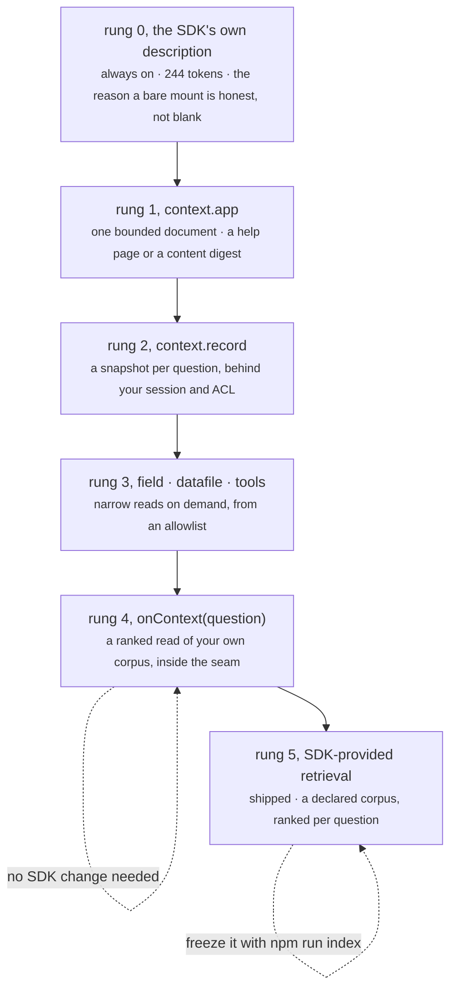

# Where context comes from: how a host feeds the assistant

`<pslm-chat>` has no idea what a survey, a study, a blog or a metadata field is. Everything it knows about
the page it is on comes from one async callback or from what a manifest declares:

```js
chat.onContext = async (question) => {
  // return the text to place in the system message, or throw
};
```

That single seam is what keeps the component general and the host in charge of its own permissions.

This document is the **ladder**: the five ways context can reach the model, in order of capability, what
each one costs, and. The part that decides whether answers are good, **where to stop climbing**.

## The ladder




| rung | mechanism | declared as | who owns the budget | enough when |
|---|---|---|---|---|
| **0** | the SDK's own description | always on | SDK | always. It is what makes the assistant honest about its limits |
| **1** | one bounded document | `context.app` | host (`maxBytes`) | the corpus fits the cap as one flat document |
| **2** | one snapshot per question | `context.record` | host (ACL + `maxBytes`) | questions are about the object on screen |
| **3** | narrow reads on demand | `context.field`, `context.datafile`, `tools` | host (allowlist + caps) | the corpus is addressable by id or pointer, and the model should choose |
| **4** | a ranked read at the seam | `chat.onContext(question)` | host (its own index) | the corpus outgrows the cap and needs for each question selection |
| **5** | SDK-provided retrieval | *nothing exists* | would be SDK | only if rung 4 measurably fails: see below |

**Rungs 0, 4 need no SDK change.** Rung 4 works because `onContext` receives the *question*, not just the
turn: a host can score its own corpus per question. That was designed in, which is why retrieval has never
been blocked on the SDK.

## Rung 0: nothing declared

There is no "no context" state. The SDK ships its own description (`DEFAULT_CONTEXT`, ~244 tokens): what
the model is, that it runs in this tab, that it can be wrong, that it cannot see the page or change
anything, and that it must never invent a saved value. The host's text is **appended** to it, never
substituted for it, so nothing a host does can make the assistant claim a capability it does not have.

A host that declares nothing still gets a working assistant that says it is ungrounded, and the provenance
reads `no host context — answered from Portable SLM's own description only`. That is why the component
drops into a page it knows nothing about, and why the bundled panel mounts with no manifest rather than
erroring for lack of one.

## Rung 1, one bounded document: `context.app`

```json
"context": { "app": { "url": "app.md", "maxBytes": 8192, "kind": "content" }, "credentials": "none" }
```

- **Paths resolve against the manifest**, not the page, so `"app.md"` works whether the pack is served at
  `/`, at `/portable-slm/`, or under a nested base. Absolute paths stay absolute. That is what your own
  API routes should be.
- **`kind` says what the document is.** `"help"` (default) is how to *use* the application, and the model is
  told to offer general guidance when the text does not cover the answer. `"content"` is material to answer
  questions *about*, and the model is told to answer plainly or say the document does not cover it, never
  to fall back and never to end by asking what the user wants. A typo fails the mount.
- **`credentials`** is `"same-origin"` (default) or `"none"` for a public document that must not travel with
  the user's cookies. It applies to every declared read and tool.
- **The cap is a correctness control**, because the document is resent on every question. Truncation keeps
  the **head** and drops the tail, so order by importance: durable facts first, long or volatile content
  last. State the truncation inside the text so the model and the disclosure both see it.
- **HTML is refused.** A login page must never become a prompt, and a redirect-to-login served with HTTP 200
  is exactly what a naive fetch would paste in.

A static file has **no access control**. It is served to anyone who asks. This rung holds documentation,
never data.

## Rung 2, a snapshot per question: `context.record`

```json
"context": { "record": { "url": "/api/record/{id}?exclude_private_fields=1", "maxBytes": 12288 } }
```

- Only `{id}` and `{pointer}` are substituted, and they are URI-encoded, so a manifest cannot smuggle a
  dynamic segment into a request. **`{id}` comes from the route, never from the model.**
- **Inherit the user's authority, never bypass it.** The read uses the page's own session, so the assistant
  sees exactly what the signed-in user sees. Signed out, the request fails and the panel says so; a record
  the user cannot open yields 403 and no metadata. There is no second credential to leak.
- **Refetch every turn.** Do not cache the snapshot: people edit while they ask, and a stale snapshot
  produces confident advice about a field that no longer says that.
- Failure messages are for the reader. `"HTTP 401"` is a symptom; `"sign in as a curator with access to
  this project"` is a diagnosis, and the panel prints whatever you throw.

## Rung 3, narrow reads on demand: `context.field`, `context.datafile`, `tools`

The model asks for a slice, and the manifest is the allowlist:

- **`context.field`** keeps a task narrow, improving one abstract ships `{ pointer, value }`, never the
  whole record. Its `pointers` list is also what feeds a tool's `enum`, so a host that declares none fails
  at mount rather than mid-conversation.
- **Declared tools** are same-origin GETs the model may name. Arguments are validated against the declared
  schema, the record id is pinned to the page, results are capped, and each call waits for approval by
  default (`"toolApproval": "auto"` removes the click for your own read-only tools, never the reach).
- **Prefer narrow over broad.** Rung 2 sends everything about one object; rung 3 sends the one thing the
  question needs. For a big object, rung 3 is both cheaper and more accurate.

## Rung 4, a ranked read at the seam: `chat.onContext(question)`

When the corpus outgrows the cap, stop pasting and start selecting. The seam already has what you need.

**Keyword scoring first (BM25/TF-IDF, ~80 lines, no dependency, no model).** Deterministic, offline, and
explainable: you can always answer *why was this chunk chosen*. At documentation scale it is not the weak
option, it is the auditable one.

```js
// The host fetches and scores its own index — the SDK knows nothing about it, and no contract change is
// needed to retrieve. That is the point of the seam.
const index = await (await fetch("/pslm.index.json")).json();   // [{ id, path, text, url, version }]
chat.onContext = async (question) => {
  const hits = rankChunks(index, question).slice(0, 6);
  return hits.map((h) => `### ${h.path}\n${h.text}`).join("\n\n");
};
```

**Corpus shape.** One section per chunk, headings kept, and a `version` stamped alongside the content so a
cache can be keyed to it. Build it from whatever your content already is: generating a document from the source content at build
time beats hand-maintaining one, and both worked hosts do it that way.

**Always in the window, regardless of rank:** the glossary, or the two-paragraph "what this application is".
Cheap, and it stops the model inventing what a "study" or a "dissagregation" is.

**Three rules retrieval must not violate:**

- **the cap is still the cap.** Top-k inside `maxBytes`, and truncation stays visible.
- **the disclosure shows the chunks that were chosen**, not the corpus they came from. Auditors read what
  went in. The panel's "What was sent to the model" is the artefact.
- **rank is your code, and it is testable.** A retriever nobody scores is a retriever that quietly got
  worse.

**Build the ruler before the machine.** A small golden set, including questions the corpus cannot answer,
turns "the answers feel worse" into a number. [`ANSWER_QUALITY.md`](ANSWER_QUALITY.md) has the method, and
the *abstention rate* on the unanswerable third is the number that matters most.

## Rung 5, SDK-provided retrieval: shipped

Declare a corpus and the SDK ranks it: `context.documents` names the text, `retrieval` sets the knobs, and
`context.app` stays the short document that is always in the prompt. The ladder's rule was honoured rather
than waived: this shipped **after** keyword ranking was measured, on real corpora, to miss answers a human
finds by paraphrase.

What the measurements decided, rather than taste:

- **Both scorers, always.** BM25 finds `house_hold_id` and `delete/{id}` exactly and cannot find "who paid for
  the survey"; embeddings do the reverse. Each is weak where the other is strong, which is why the fusion is
  the default rather than a choice between them.
- **The tier is chosen per corpus.** On a 12 KB site corpus the bundled encoder and the 181 MB one were one
  question in ten apart in the top three; on a 1.9 MB documentation corpus they were equal in first place and
  one question apart in the top three. So the bundled tier is the default and the larger one is for corpora
  where schema-semantics questions demonstrably fail.
- **The floor is per corpus, measured.** Documentation is full of generic vocabulary, so on a documentation
  corpus no floor separated unrelated questions cleanly; on a small curated corpus 0.30 did. A host that does
  not measure is choosing a number at random.
- **Freezing is what makes it usable at scale.** Indexing a 1.9 MB corpus measured 96 seconds; frozen with
  `npm run index` the reader fetches vectors instead.

What is still open is in [`RETRIEVAL.md`](RETRIEVAL.md): per-record corpora need `{id}` expansion in
`context.documents`, and no test yet ingests a real documentation set.

## Where to stop climbing

| your situation | stop at |
|---|---|
| any page, no host knowledge, must never be wrong about data | **0**: and say so on screen |
| content you control, under the cap, public | **1** |
| one object on screen, behind your session | **2** |
| a large object, or a choice the model should make | **3** |
| a corpus bigger than the cap, or questions that need selection | **4** |
| a corpus bigger than the cap | **4** to rank it yourself, or **5** to declare it and let the SDK rank it |

The rule underneath: **stop at the rung that fits the cap, and climb only when you can measure the
failure.** Training a ranker before you have measured the need is how a small local model acquires a
reputation it does not deserve, and the cap, the disclosure and the golden set are what keep the rungs
honest wherever you stop.

## Division of labour

| Concern | `<pslm-chat>` (fixed) | The host (yours) |
|---|---|---|
| when context is read | once per question, at send time |: |
| where it comes from | does not know, cannot look | route, query, filters, index |
| who is allowed to see it | never decides | session, ACL, `exclude_private_fields`-style flags |
| size limit | applies the declared `maxBytes`; imposes none of its own at the seam | the cap, stated in the returned text |
| prompt shape | system + context → one system message, then trimmed history, then the question | may set `system`, not the assembly |
| what the model is told about itself | `system` attribute is passed through verbatim | writes it |
| sampling, history depth, caps | owns them | should not override per question |
| disclosure | shows the exact string sent | must not lie about it |
| grounding check | compares answer to the string it sent |: |
| failure handling | aborts the turn, prints the message | the message must say what to do |
| writes | none, structurally | owns save, review, publish |

Two rows are the ones hosts most often get wrong. **Size**: at the seam the component will happily send a
400 KB string into an 8 K-token window and the engine will fail opaquely. The cap is yours there, while a
declared `maxBytes` applies it for you. **Failure message**: the component prints whatever you throw.

## Worked example: rungs 2 and 3

A host with an API about one object. The routes are this application's own; nothing here is recognised by
the SDK.

```json
{
  "apiVersion": "pslm-host/1",
  "context": {
    "record": { "url": "/index.php/api/editor/json/{id}?exclude_private_fields=1", "maxBytes": 12288 },
    "field":  { "url": "/index.php/api/editor/json_field/{id}?path={pointer}", "maxBytes": 4096,
                "pointers": [ { "pointer": "/identification/title", "label": "Title" } ] },
    "credentials": "same-origin"
  },
  "models": { "mirror": "/models/" },
  "writeBack": false
}
```

```js
chat.system = "Answer using only the snapshot… never claim to save or publish.";
chat.onContext = async () => {
  const record = await fetchRecord(manifest, root.dataset.recordId);   // {id} substituted, encoded
  return record.truncated ? `${record.text}\n… truncated to fit the byte cap` : record.text;
};
```

One measured case, a record carrying a data dictionary: 14 569 bytes of descriptive metadata and variable
definitions, and never an observation row. The cap, not the query, decided what fitted. A host's own
measured example, with the endpoints it really uses, is in
[`../examples/README.md`](../examples/README.md).

## Sketch: rung 4, a content site

```js
const index = await (await fetch("/pslm.index.json")).json();
chat.onContext = async (question) => {
  const hits = rankChunks(index, question).slice(0, 6);
  const head = index.find((c) => c.id === "glossary")?.text ?? "";
  return `${head}\n\n${hits.map((h) => `### ${h.path}\n${h.text}`).join("\n\n")}`;
};
```

Same component, same rules, different vocabulary. That is the point. This repository's own site starts at
rung 1 (`context.app` with `kind: "content"`, 6 874 of 8 192 bytes) and will move to rung 4 when the digest
starts losing the tail.

## Checklist before shipping a provider

- [ ] the rung is written down, and the reason to stop there is written down with it
- [ ] endpoint is the same one the host UI uses, with the user's own session (or `credentials: "none"` if the document is public)
- [ ] `context.app.kind` matches what the document is, `"content"` for material to answer from, not `"help"`
- [ ] byte cap applied, truncation stated in the returned text
- [ ] failure message says what to do (sign in again, open the record, check access)
- [ ] `writeBack` stays false; nothing in the panel can mutate anything
- [ ] "What was sent to the model" inspected by a human on a real record. It is the audit artefact
- [ ] at rung 4: the golden set exists, it includes unanswerable questions, and the chosen chunks are what the disclosure shows
- [ ] tested signed out, on a record the user cannot open, and on a record that trips the cap

A worked host's side of this division, in the host's own repository rather than here, is documented in
[`../examples/README.md`](../examples/README.md).
